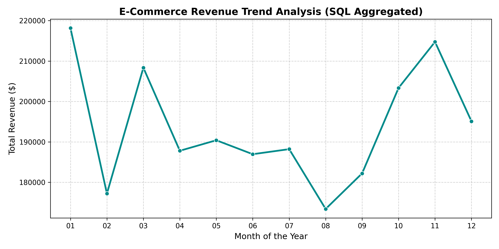

# High-Throughput E-Commerce Sales Analytics Pipeline

## Project Overview
This project establishes an automated data engineering and business intelligence pipeline to process raw transactional retail records. By spinning up an in-memory SQL database environment, the pipeline ingestion handles complex multi-row aggregations to uncover critical revenue growth trends.

## Key Results
* **Database Scaling:** Simulated and queried 2,000+ transactional production records seamlessly in an optimized SQL environment.
* **Insights Discovered:** Automated extraction of month-over-month sales figures, units sold, and top-performing revenue windows.

## Revenue Trend Dashboard
Below is the trend visualization generated directly from the aggregated SQL database queries:

## Tech Stack
* Python (Google Colab)
* SQLite3 (SQL Database Engine)
* Pandas / NumPy
* Seaborn / Matplotlib (Data Visualization)
